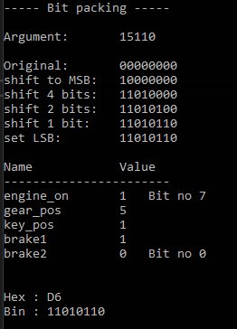

Programs written in C with extensive comment explanations in the source files.

# Table of Contents

[Bit packing](#bit-packing)  
[Arrays and files](#arrays-and-files)  
[Binary files](#binary-files)  
[Linked List](#arrays-and-files)  
[Caesar shift encryption](#caesar-shift-encryption)

## Bit packing

Demonstration of packing bits into a byte using the example of a `struct` containing different car parts.

Each `struct` field is set to hold a certain number of bits:

```C
// Struct that specifies the number of bits in which unsigned int fields are stored
typedef struct  
{
    unsigned int engine_on  : 1;    // holds 1 bit  - the engine is on or off. bit no 7 (MSB, value 128 decimal).
    unsigned int gear_pos   : 3;    // holds 3 bits - the position of the gear. 3 bits = 2^3 = 7 positions
    unsigned int key_pos    : 2;    // holds 2 bits - the position of the key. 0=stop, 1=on, 2=engine starter on
    unsigned int brake1     : 1;    // holds 1 bit  - position of the front brakes
    unsigned int brake2     : 1;    // holds 1 bit  - position of the rear brakes. bit no 0 (LSB).
} CAR;
```

### Example

Input: `15110`. Given the number of bits each field is allocated, the conversion to binary:

| field | dec | bin |
|-------|:-----:|-----:|
| e     | `1`   | 1   |
| g     | `5`   | 101 |
| k     | `1`   | 01  |
| b1    | `1`   | 1   |
| b2    | `0`   | 0   |

Consolidated:

| 1 | 1 | 0 | 1 | 0 | 1 | 1  | 0  |
|---|---|---|---|---|---|----|----|
| e | g | g | g | k | k | b1 | b2 |

The bit packing is then achieved by left-shifting the bits to their respective position in the byte by using the OR operator on the byte.

Program output:



[](#table-of-contents)

## Arrays and files

Copies a size-limited input string received either via the keyboard during runtime, as an argument passed on the command line, or via redirected file input.

```shell
$ ./main
inputFromKeyboard1234567891

strcpy   : inputFromKeyboard12
func copy: inputFromKeyboard12
```

```shell
$ ./main inputFromArgPassedCmdLine

strcpy   : inputFromArgPassedC
func copy: inputFromArgPassedC
```

```shell
$ ./main < myfile.txt

strcpy   : inputRedirectFile
func copy: inputRedirectFile
```

[](#table-of-contents)

## Binary files

Operations on binary files: create, append, read records.

A console-based menu-driven program that imitates managing a database of people. The data is stored as a binary file.

```console
----- Database Management -----

1. Create a new file and delete the old file
2. Add a new person to the file
3. Search for a person in the file
4. Print out all in the file
5. Exit the program

Select option [1-5]: 1

Successfully created the file and inserted a dummy record!

<.. menu ..>
Select option [1-5]: 2

--- Add a record to the file ---
Enter first and last name: Lunia Bertrand
Enter your person number: 6908125521

Added Lunia Bertrand to the database!

<.. menu..>
Select option [1-5]: 4

--- Printing all data from file ---

[0] Dummy Record
[1] Lunia Bertrand

----------- end of file -----------

<.. menu..>
Select option [1-5]: 2

--- Add a record to the file ---
Enter first and last name: Eddie

Error: invalid input. Couldn't add person!
```

[](#table-of-contents)

## Linked list

Implementation of a doubly-linked list. By default, a random list is created. Memory leak detection (VS) is enabled in _DEBUG mode.

```console
Post nr 0 : 60      | Prev: [null], Next: [72]
Post nr 1 : 72      | Prev: [60], Next: [33]
Post nr 2 : 33      | Prev: [72], Next: [44]
Post nr 3 : 44      | Prev: [33], Next: [75]
Post nr 4 : 75      | Prev: [44], Next: [null]
```

[](#table-of-contents)

## Caesar shift encryption

A simple encryption program that shifts each character of a text by a specified amount (Caesar Shift Cipher).
Demonstration of basic string/char handling and manipulation.

`Default shift = 13`

```console
Enter text to encrypt:
Caesar

Encrypted text:
Pnrfne
```

`Provided shift = 45`

```shell
$ ./main 45
Enter text to encrypt:
CaesarShiftEncrypy

Encrypted text:
VtxltkLabymXgvkrir
```

[](#table-of-contents)