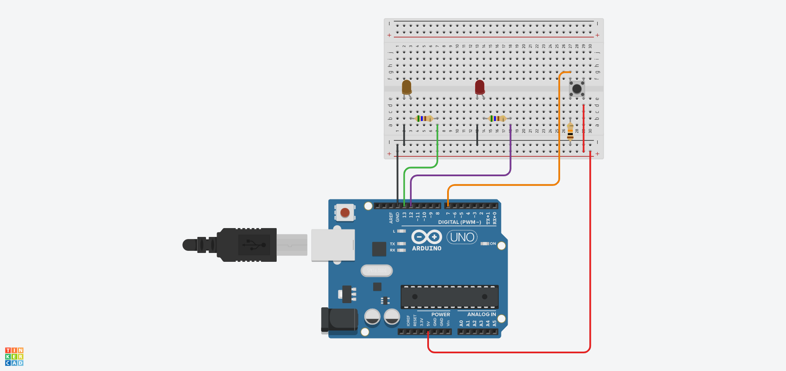
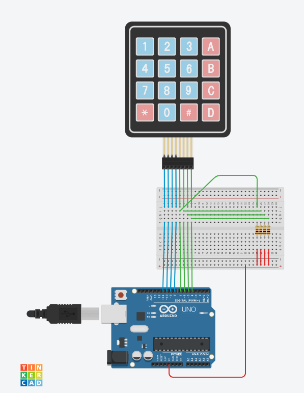

# Basics

## Blink LED

A simple system with a periodically blinking LED
and an additional LED that is turned on/off when a
button is pressed/released.

## Keypad

Basic use of a keypad with and without the use of the [Keypad.h](https://www.arduinolibraries.info/libraries/keypad) library.

