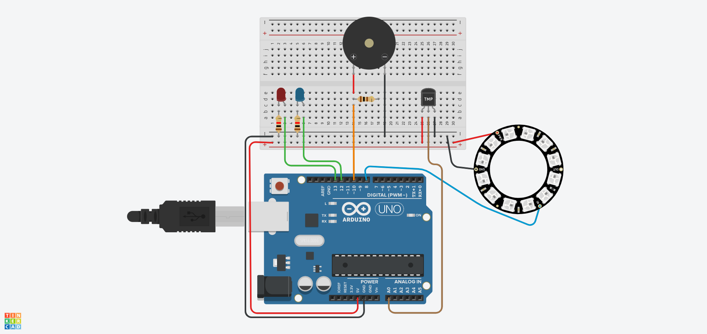
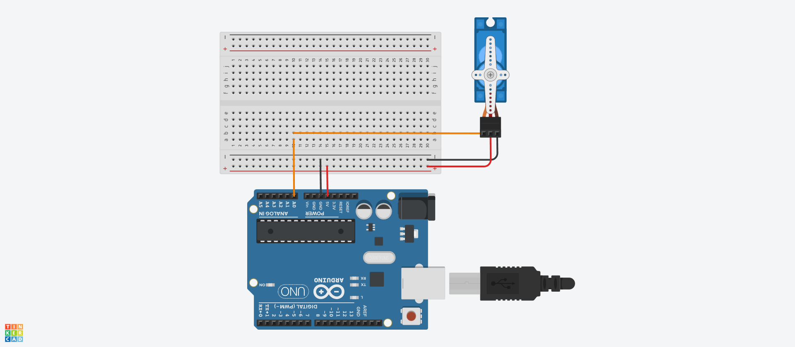
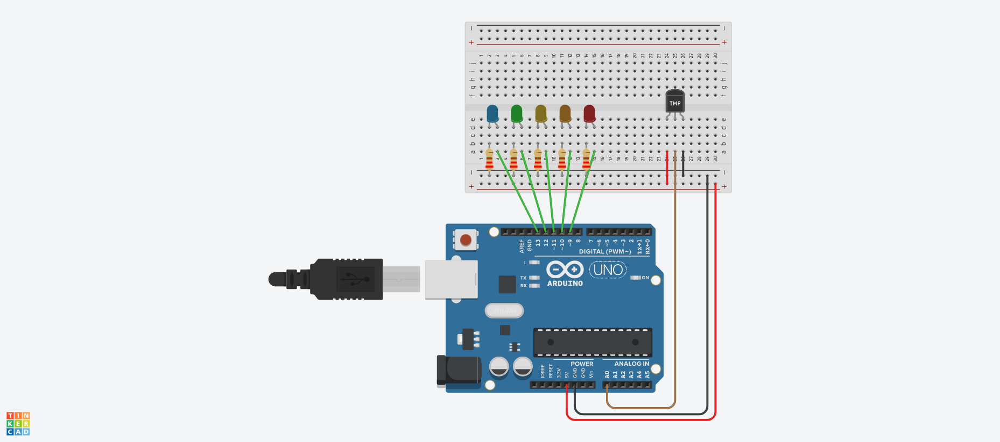

# Interrupt timers

A collection of Arduino projects using timers on interrupt.

## NeoPixel addressable LEDs

This system uses a NeoPixel LED strip that lights up more LEDs on the strip the higher the measured temperature. If the temperature is above or below
the minimum or maximum temperature thresholds, an additionally red or blue LED respectively is activated, and a Piezo buzzer is sounded as an alert.

## Timer interrupt with Servo motor

An analog timer is used to move a Servo motor once every second. The 8-bit `Timer 2` is used for the Interrupt Service Routine (IRS) to avoid conflict with the Servo library's (default) use of `Timer 1`.

## Temperature ranges

A system that measures the temperature using `Timer 1` interrupts. An LED is activated based on how hot or cool it is. Each of the five LEDs represents a different temperature range from below 9°C to above 25°C.

