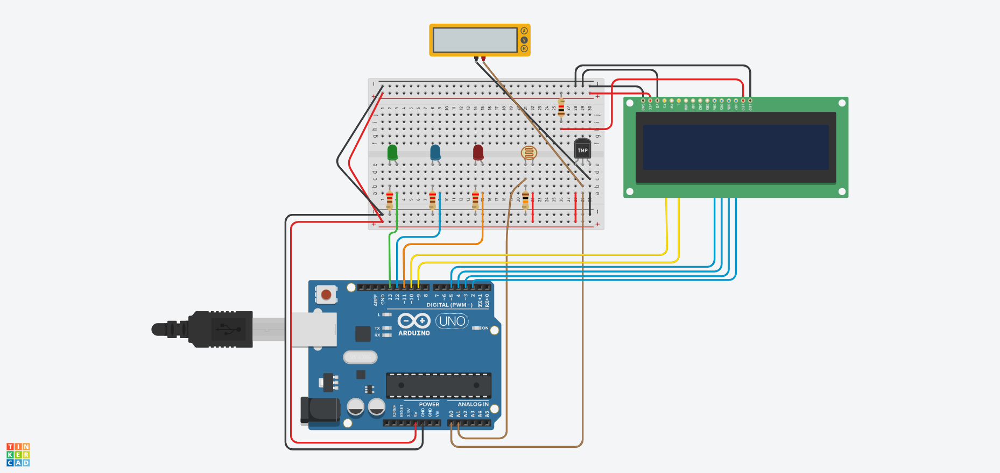

# Temperature and light sensor

This system displays the relationship between the measured temperature and light intensity. Different LEDs will be activated depending on how closely the light intensity matches the current temperature:

 expected relationship

 temperature is lower than expected given the light intensity

 temperature is higher than expected given the light intensity

